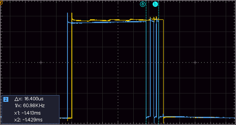

# Button debouncer using the Raspberry Pico PIO 

## Update 

The new version allows the use of all 8 PIO state machines, and thus debounce up to 8 gpio.

It also allows setting of the debounce time between 0.5 to 30 ms.

## Original text

When using a GPIO to read noisy input, such as a mechanical button, it may happen that the signal read by the microcontroller rapidly switches back and forth, which may lead to false detection of several button presses where only one was intended. To prevent this, some hardware solutions exist as well as software solutions. This project is a software debouncer that makes sure that only after the input signal has stabilized, the code will read the new value. The downside of debouncers is that they usually cost some processing time to function. For Arduino a simple debouncer can be found [here](https://www.arduino.cc/en/Tutorial/BuiltInExamples/Debounce).

The nice thing about the [Raspberry Pico](https://www.raspberrypi.org/documentation/pico/getting-started) is that it has 8 programmable IO (PIO) blocks that work independent of the main cores. I wanted to try my hand at programming the PIO and decided to do something I hadn't already seen as an example: a debouncer. The debouncer runs on one of the state machines of a PIO instance (there are two PIO instances and each has 4 state machines.)

The c++ code contains a class that starts the PIO code and lets the user code read the debounced pin state. The PIO code is as follows:

        jmp pin isone     ; executed only once: is the pin currently 0 or 1?
    iszero:
        wait 1 pin 0      ; the pin is 0, wait for it to become 1
        set x 31          ; prepare to test the pin for 31 times
    checkzero:
        jmp pin stillone  ; check if the pin is still 1
        jmp iszero        ; if the pin has returned to 0, start over
    stillone:
        jmp x-- checkzero ; decrease the time to wait, or the pin has definitively become 1
    isone:
        wait 0 pin 0      ; the pin is 1, wait for it to become 0
        set x 31          ; prepare to test the pin for 31 times
    checkone:
        jmp pin isone     ; if the pin has returned to 1, start over
        jmp x-- checkone  ; decrease the time to wait
        jmp iszero        ; the pin has definitively become 0

## Explanation of PIO code
* Start with the assumption that the pin is in a steady state.
  If it is currently 1, then go to 'isone'; if it is currently 0, then go to 'iszero'
* The code after 'isone' works as follows:
  * Since the pin is 1 wait for a change to 0
  * If that happens, set 31 into the x scratch register
    * This is the amount of 'time' the debouncer will wait before switching over. The actual amount of time is also dependent on the clock divisor, and the fact that two jmp statements are executed for a test. Edit: in the updated version the debounce time can be set in ms.
  * The program keeps checking if the input changes back to 1; and if so, start over at 'isone'
  * If the input does not change back, complete the loop of counting down from 31
  * If the x scratch register becomes 0, the signal has definitively switched to 0; start from 'iszero'
* The branch of 'iszero' works similarly, but is structured a little bit differently because the `jmp pin` statement jumps on 1, not 0

There is one more important aspect to consider: the user code needs to read the debounced pin. So, somehow information from the PIO state machine has to go to the user code. I have considered several options:
* Use the FIFO much like the [uart_rx](https://github.com/raspberrypi/pico-examples/tree/master/pio/uart_rx) example code
* Use the FIFO, but from the PIO code make it empty (IN NULL) for a 0 and fill it with something to indicate a 1, and test the FIFO content with pio_sm_get_rx_fifo_level, or pio_sm_is_rx_fifo_empty
* Use an interrupt, e.g. PIO0_IRQ_0 for a 0, and PIO0_IRQ_1 for a 1
* Use an interesting approach where no explicit communication between the user code and PIO code is used at all!

The option I chose is based on the fact that the user code can know where the PIO state machine program counter is during execution via `pio_sm_get_pc`. The debouncer code has a clear split between the part where the debounced value is 0 and the part where it is 1: If (offset+1 <= pc < offset+isone) the value is 0, if (pc >= offset+isone) the value is 1, where offset is the starting point of the program in the PIO memory, and pc is the program counter.

This approach keeps the code very small, and reading the debounced state is very quick.

## Does it actually work
Yes, it does. To show that the debouncer works, I have used another microcontroller to generate a repeating signal that bounces up and down a couple of times. In the figure below I have used a slightly different PIO code that sets a GPIO to 0 or 1 depending on the debounced state.

The blue line is the raw input signal. It bounces up and down a couple of times between point (a) and (b). The yellow line is the debounced pin state. It clearly follows the blue line, but skips over the bounces.

If the debouncing time is chosen too small the yellow line simply follows the blue line including the bounces, but with a slight delay.
