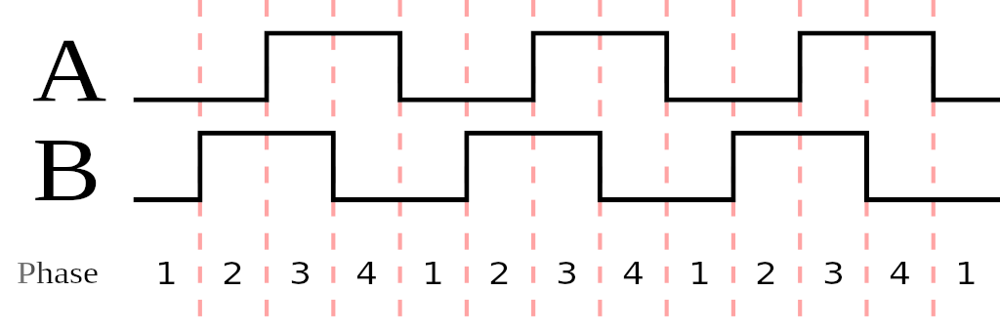
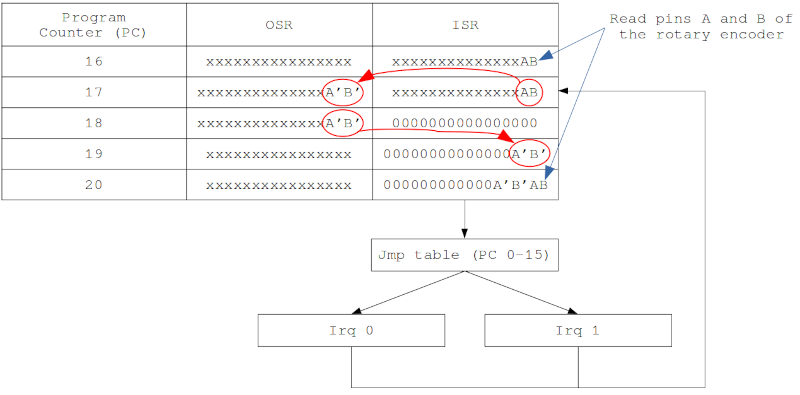

# Rotary encoder for Raspberry Pi Pico using PIO code

This software reads a rotary encoder with the Raspberry Pi Pico using PIO code. 
The rotary encoder that is used is an optical encoder with very clean signals on its output, called A and B, so debouncing of these signals is unnecessary.


The specific encoder I use gives 600 pulses per 360 degrees rotation. For each pulse, 4 signal changes are measured, see the next figure from [wikipedia](https://en.wikipedia.org/wiki/Rotary_encoder#/media/File:Quadrature_Diagram.svg), so in total 2400 transitions are made for a full rotation.



I have also tried a cheap simple rotary encoder, but only when turning very slowly does the result make any sense.

## Other code
This isn't the first code to read a rotary encoder using the PIO, see e.g. [pimoroni-pico](https://github.com/pimoroni/pimoroni-pico/blob/encoder-pio/drivers/encoder-pio/encoder.pio), which does timing and rudimentary debouncing. And it lets you choose non-consecutive pins. 

But this code uses interrupts in the PIO code to signal rotations to the C++ code. And maybe this can best be considered as an exercise on how to make something useful with:
- 19 `jmp` instructions (one hidden in a `mov exec`)
- 3 `in` instructions
- 2 `irq` instructions
- 1 `out` instruction
- 1 `mov` instruction (well ... technically 2)

But seriously, I wanted to play with a jump table in PIO code. This means setting the `.origin` to make sure the jump table is at a fixed position in instruction memory (0), and setting the initial program counter with `pio_sm_init(pio, sm, 16, &c)` to start at instruction location 16, i.e. after the jump table. It also means that the `mov exec` instruction is used to make a jump to the jump table.

## Explanation of PIO code
The first 15 addresses are a list of jumps, forming a jump table, that is later used to raise either an IRQ that signals a clockwise rotation or an IRQ to signal a counter clockwise rotation. See below.

The important steps are explained in the figure below. There the program line number, the contents of the Output Shift Register (OSR) and the Input Shift Register (ISR) are shown.

The program starts at line 16, which is only used as an initialization of the program: the two pins (whose values are denoted as A and B) of the rotary encoder are read into the ISR. The two rightmost bits are now AB. The other bits in the ISR do not play a role at this moment and are denoted as 'x'. 

The next step, line 17, is the actual start of the program: the content of the ISR is copied to the OSR. The two bits AB are to be used as the previous values, and are therefore denoted as A' and B'. 

Line 18 clears the ISR because the zero valued bits are needed later. Then, in two steps, the ISR gets shifted in the old values, A'B' from the OSR, and reads in two new readings of the rotary encoder (AB). 

Now, at line 20, the 16 left most bits of the ISR contain: 000000000000A'B'AB.
According to the [datasheet of the rp2040](https://datasheets.raspberrypi.org/rp2040/rp2040-datasheet.pdf) an unconditional jmp instruction without delay or side-set is, apart from the address to jump to, all zeros. And that is exactly what is now contained in the ISR: a jmp instruction to address 0A'B'AB. This is always an address in the first 16 program addresses (0-15). The PIO has an instruction to interpret the content of the ISR as an instruction and execute it: on line 20 the `mov exec ISR` does exactly this.



## Jump table

The first 16 instructions form a jump table. The addresses represent the 12 legal transitions and 4 error transitions that can be found in the output of the rotary encoder. As described above, the address that is jumped to is represented by the two old values and the two current values of the output: A'B'AB. The 16 transitions are:

```
A'B'A B = meaning;                                                action
--------------------------------------------------------------------------------------
0 0 0 0 = transition from 00 to 00 = no change in reading;        do a jump to line 17
0 0 0 1 = transition from 00 to 01 = clockwise rotation;          do a jump to CW  
0 0 1 0 = transition from 00 to 10 = counter clockwise rotation;  do a jump to CCW
0 0 1 1 = transition from 00 to 11 = error;                       do a jump to line 17
0 1 0 0 = transition from 01 to 00 = counter clockwise rotation;  do a jump to CCW 
0 1 0 1 = transition from 01 to 01 = no change in reading;        do a jump to line 17
0 1 1 0 = transition from 01 to 10 = error;                       do a jump to line 17
0 1 1 1 = transition from 01 to 11 = clockwise rotation;          do a jump to CW  
1 0 0 0 = transition from 10 to 00 = clockwise rotation;          do a jump to CW  
1 0 0 1 = transition from 10 to 01 = error;                       do a jump to line 17
1 0 1 0 = transition from 10 to 10 = no change in reading;        do a jump to line 17
1 0 1 1 = transition from 10 to 11 = counter clockwise rotation;  do a jump to CCW
1 1 0 0 = transition from 11 to 00 = error;                       do a jump to line 17
1 1 0 1 = transition from 11 to 01 = counter clockwise rotation;  do a jump to CCW
1 1 1 0 = transition from 11 to 10 = clockwise rotation;          do a jump to CW  
1 1 1 1 = transition from 11 to 11 = no change in reading;        do a jump to line 17
```
The jump to `CW` is a piece of code that sets `irq 0` and then jumps to line 17, the jump to `CCW` sets `irq 1` and then jumps to line 17.
In the C++ code, the `irq 0` causes a counter called `rotation` to be increased, the `irq 1` causes it to be decreased.
