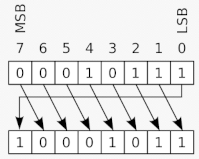
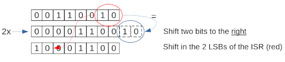
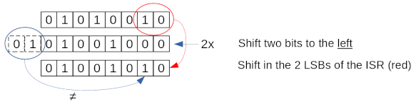

# Use the ISR for rotational shifting
Normally if the ISR shifts via the `IN` instruction, the bits that come out of the ISR go to cyber space, never to be heard from again. Sometimes it is handy to have rotational shifting. The [figure below](https://en.wikipedia.org/wiki/Circular_shift#Applications) shows a rotational right shift of one bit. Note that the Least Significant Bit (LSB) shifts to the Most Significant Bit (MSB).



In PIO code the ISR can be used to shift bits in the direction given by the c-command `sm_config_set_in_shift(&c, direction, false, 0)` where direction=true means shift to the right, and direction=false means shift to the left. The `IN` instruction has an option to shift bits into the ISR from the ISR itself via `IN ISR <Bit count>` instruction. This opens up the possibility of making it shift rotationally. The algorithm used by `IN ISR <Bit count>` is as follows:

shift the ISR for `<Bit count>` bits in the direction specified by `sm_config_set_in_shift`, and shift in the LSBs of the original ISR value.

## Right shifting
For right shifting this works just fine, it basically comes down to every bit that would normally go to cyber space is saved and shifted in as the MSB. In the figure below the two steps are shown for eight bits (the ISR has 32) and the instruction `IN ISR 2`:



On the top the ISR has the bit value 00110010, in the middle it has shifted two bits, and on the bottom the two LSBs of the original ISR are shifted in the same order as the MSBs (these are the same as the two bits shifted out in the blue circle). This results in a bit value 10001100, which is exactly a two bits rotational shift of the ISR.

## Left shifting
For left-shifting, however, this does not work well, consider the following example:



The ISR at the start has a bit value of 01010010, and after shifting to the left, the two LSBs of the original ISR are shifted in on the left. These are not the two bits that were shifted out (blue circle)! So, no rotational shifting to the left.

It is possible to obtain true rotational left shifting. The trick is that the direction of shifting must be set to right shifting: `sm_config_set_in_shift(&c, true, false, 0)` and the following PIO code can then be used to left shift the ISR for two bits (other `<Bit counts>` are of course also possible):
```
mov ISR :: ISR
in ISR 2
mov ISR :: ISR
```
In the above PIO code, the `::` symbols reverses the bit order in the ISR, effectively turning the correctly working right shift into a left-shift.