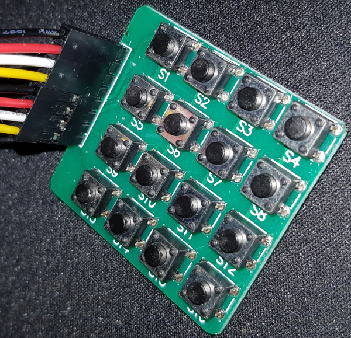

# 4x4 button matrix

This code reads a 4x4 button matrix using PIO code for the Raspberry Pico. In the image below a simple 4x4 button matrix is shown. Four of its pins are connected to the rows (from the PIO code perspective these are outputs) and the other 4 are connected to its columns (used as pulled down inputs).

The PIO code alternatingly sets one row to HIGH and the others to LOW. The four column pins are read by the 'in pins 4' instruction. If no button is pressed, all columns read LOW, i.e. '0000' is shifted into the ISR. If a button is pressed in the row that is HIGH, the corresponding column is also read as HIGH. 

If, after all 4 rows have had their turn of being set to HIGH, the ISR contains only zeros, no key was pressed. If it isn't zero, a button was pressed (at least one), and the ISR is pushed into the state machine's RX FIFO.

In the C/C++ code, when reading the RX FIFO it first needs to be cleared in order to not read old key presses. The consequence is that the state machine needs a little time (1 ms in the code) to fill the FIFO if a key is being pressed. If the FIFO is still empty, no key is pressed. If the FIFO does contain a value, the key is available as a bit in some position in the lower 16 bits. This is translated into a key value from 0 to 15.
