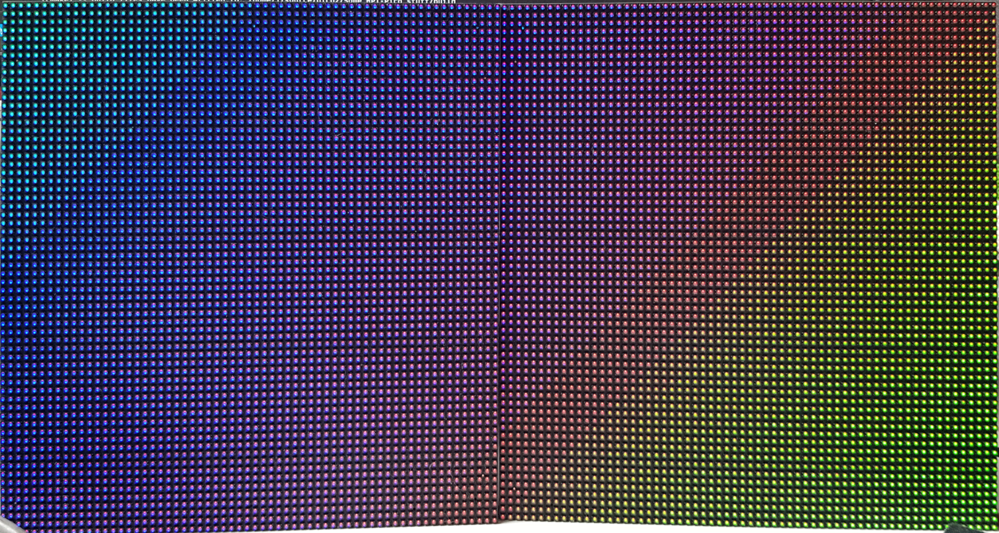
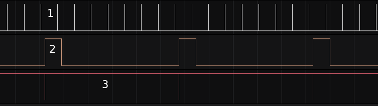
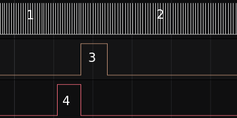
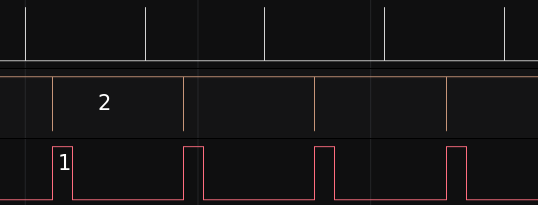

# LED panel using PIO state machine and Direct Memory Access

This code shows how a pio state machine can drive led panels. It is made for
two 64x64 led panels connected to form a 64 row x 128 column panel. There are 16
brightness levels for each Red, Green and Blue of each pixel, allowing many 
colors. In its present form it updates the panel at about 144 Hz at standard
clock settings (=125MHz.)

The main function has code for three test patterns.

There are many, many concepts that require explanation, and I do a poor
job of it in the code and header file.
Some of the things that I would like to (but do not) explain in detail here are:
* it uses two cores: core 0 generates images, core 1 transcodes it into a data format suitable for
sending it to the PIO state machine (sm).
* after transcoding, the sm continuously sends the data to the ledpanel. It uses Direct Memory Access (DMA) for this.
* double buffering is used for generating images (but not for the transcoded data structure!)
* care has been taken that every generated image is displayed.
* the images have 4 bits for each color (green, blue, red), it uses a sort of Pulse Width Modulation (PWM) to get different brightness levels for the colors and thus each pixel can have 16 * 16 * 16 = 4096 colors. See [here](https://www.galliumstudio.com/2020/04/07/stm32-episode-3-color-tricks-with-led-panels/) for an explanation of the PWM approach.
* there is also an overall brightness setting. It takes values from 0 (dimmest) to 7 (brightest).
* brightness ultimately comes down to how long a delay loop is in the sm code. 
* the file 'ledpanel.c' contains the code for core 0. It mostly consists of some simple (and simplistic) functions to make the images. In the main function three example functions are given.
* the file 'ledpanel_worker.c' contains the code for core 1: transcoding and controlling the sm via DMA.
* the sm outputs the address and color bits to the ledpanel and executes the delay loop that determines the brightness. 
* I used the interpolator hardware! This must be one of the few examples that uses it. And I do not use it for what it was intended for: it just reorders some bits, see the (somewhat vague) explanation in 'ledpanel_worker.c'.

This image shows the first of the three example animations in the main function: a skewed rainbow that shifts position with time:

## Some words about the timing of the various functions

In the figure below the data of three logical analyzer channels are shown (many thanks to [Saleae](https://www.saleae.com/)) for the first example in the main function (the skewed rainbow):

The top line shows when the DMA interrupt is busy. This interrupt restarts the DMA channel such that the sm can send data to the ledpanel. The restarting of the DMA takes very little time, so only a peak is visible in the figure. The important thing is the time between those peaks (the 1 in the figure). At the highest brightness level that I use, the peaks are 6.93 ms apart, this translates into a display update frequency of 144 Hz.

The bottom line is the process generating the images on core 0. It is clear that generating images is the slowest process, see 3 in the figure. Generating the rainbow image costs more than 55ms.

The channel in the middle is the transcoding function on core 1. It takes almost 7ms to transcode an image, see 2 in the figure.

In the figure below the same channels are shown for the second example in the main function: red and blue gradients overlapping for 8 overall brightness levels. At the lowest brightness level the updating of the ledpanel (top channel)
takes 590 us, at 1 in the figure, while one brightness level higher takes 640 us (at 2 in the figure). At the highest brightness level it is 6.93 ms.
Generating the figure takes almost 6 ms, the pulse at 4 in the figure. Note that in the code there is a 1 second pause between generating images at different brightness levels.

In the figure below the timing for the third example in the main function (three moving lines) is shown. Generating a new image takes little time: 1.15 ms, see 1 in the figure. The transcoding, 2 in the figure, is continuously busy. The code has been made such that all images are displayed: core 0 has to wait for core 1 to finish transcoding.

