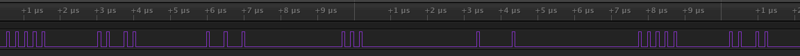

# Subroutines in PIO code

## What? Subroutines? There's no such thing in pioasm
That is true, but you can make something that works like subroutines.

What is needed is a way to specify a return address, and for the subroutine to actually jump to that return address.
Specifying a return address can be achieved by using the labels in the pio code. For this to work it must be made sure that the pio program starts at address 0 in the pio memory. This is achieved by starting with `.origin 0`. The return address can be stored in any of the registers, in the example below x is used, in the [example code](https://github.com/GitJer/Some_RPI-Pico_stuff/blob/main/subroutines/subroutine.pio) the ISR is used, but OSR and y are just as good. You only need to remember to not use the register with the return address in the subroutine. At the end of the subroutine the return address is used to jump back to the main code. This can be done in several ways (assuming the OSR is used for the return address): 
- In the example below the property is used that a jmp to an absolute address is all 0's plus the return address in the last 5 bits. Then `mov exec OSR` can be used to execute that jump.
- In the same way `out exec 32` can be used.
- It is also possible to directly jump to the return address by placing the return address in the program counter using `mov PC OSR`.
- In the same way `out PC 5` can be used.

In the example below two subroutines are used: sub_set_one and sub_set_zero. The return address is in x and jumping to that address is done by `mov PC x`. 
```
.program subroutine
    ; START THE PROGRAM AT ADDRESS 0
.origin 0

start:
        ; set the return address in x, then in OSR
    set x ret1
        ; jump to subroutine to set the pin to 1
    jmp sub_set_one
ret1:
        ; set the return address in x, then OSR
    set x start
        ; jump to subroutine to set the pin to 0
    jmp sub_set_zero

sub_set_one:
        ; set pin to 1
    set PINS 1
        ; return to the address set in OSR
    mov PC x
sub_set_zero:
        ; set pin to 0
    set PINS 0
        ; return to the address set in OSR
    mov PC x
```

## Is it useful?
In the PIO memory there is only room for 32 instructions, so using subroutines which require some overhead in the number of instructions (setting up the return address, jumping to the subroutine, jumping to the return address) quickly costs more than just writing what you want as one piece of code. In the example above it would clearly be better to just make a loop that toggles a pin.

In the [example code](https://github.com/GitJer/Some_RPI-Pico_stuff/blob/main/subroutines/subroutine.pio) a somewhat more elaborate subroutine is used: a (nonsensical) protocol that sends 5 bits and then pauses for a specified number of instructions before returning to the main program. It produces:



In that code, the subroutine consists of 7 instructions and it is called 5 times. Setting up and jumping to it costs 5 instructions. In total all 32 instruction memory locations are used. If one would program the functional parts (sending 5 bits and pausing) directly it would cost about 41 instructions, which would not fit in memory. 

So, this is a proof of principle that using subroutines can - in some cases - be used to do more with the limited memory space than is possible with just writing the code in one program.
